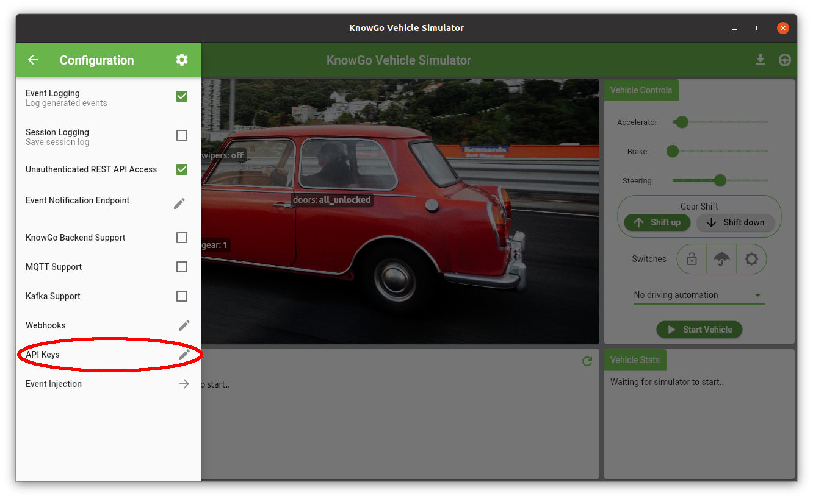
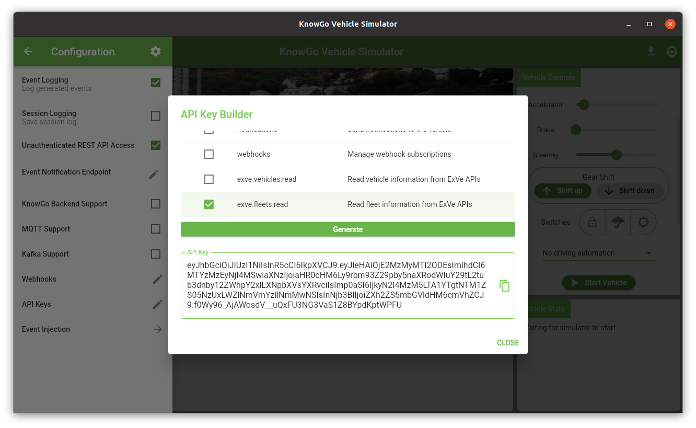

# Authorization

By default, the simulator accepts unauthenticated requests to all REST
API endpoints. This behaviour is generally more convenient during
development, but is disabled in production deployments, where endpoint
authorization is controlled by various access scopes encoded in a
JWT-based authorization token. These are further described below.

## Scopes

Possible authentication scopes are provided on a per-API basis and
apply not only to the endpoints, but also the method of access:

| <div style="width:180px">Scope</div> | Description             |
|----------------------|-----------------------------------------|
| `simulator:read`     | View information about the Simulator    |
| `simulator:write`    | Control and update Simulator state      |
| `raw_events:read`    | Read raw vehicle event telemetry        |
| `raw_events:write`   | Submit raw vehicle event telemetry      |
| `notifications`      | Send notifications to the vehicle       |
| `webhooks`           | Manage webhook subscriptions            |
| `exve.vehicles:read` | Read vehicle information from ExVe APIs |
| `exve.fleets:read`   | Read fleet information from ExVe APIs   |

!!! note
    The `simulator` and `raw_events` scopes are specific to the
    simulation environment, and are not supported by the
    [KnowGo Car API]. Applications that are targeting production
    deployment with live vehicle data should, therefore, avoid their
    use.

[KnowGo Car API]: https://knowgo.io

## API Keys

### Configuring the Signing Key

API Keys are signed with a hardcoded key by default. This isn't a
concern for local testing during development, but should be changed
if keys are to be shared or tied to specific simulator instances. In
order to prevent leaking the signing key through the configuration
artifacts, this value must be set through the `KNOWGO_SIGNING_KEY`
environment variable. The key may be set to any arbitrary string, and
will be used both for the generation of API keys and validation of the
keys by the individual simulator instance.

### API Key Generation

API Keys are generated directly within the simulator, via the `API Keys`
configuration item:



This will open up the `API Key Builder` dialog, in which the desired
scopes can be selected, the key generated, and directly copied to the
clipboard:



Note that the API Key itself is stateless and not persisted in any way
by the simulator (although the previously generated key will remain
visible while the simulator is running, it will be discarded when the
simulator is closed). Multiple API keys for different applications requiring
differing degrees of access may also be generated by simply amending the
scope selection and re-generating the key.

Authenticated requests to the REST API can be made by inserting the key
into the `Authorization` header:

```
$ curl -X GET -H 'Authorization: Bearer <insert key here>' localhost:8086/simulator/info
{"AutoID":984,...}
```

## Securing the REST API

With requests now authenticated, the `Unauthenticated REST API Access`
configuration option should also be disabled:


This will ensure that access to resources or access methods not covered
by the contained scopes will return 403 authorization errors instead of
silently passing through:

```
$ curl -X GET localhost:8086/simulator/info
Access denied
```
