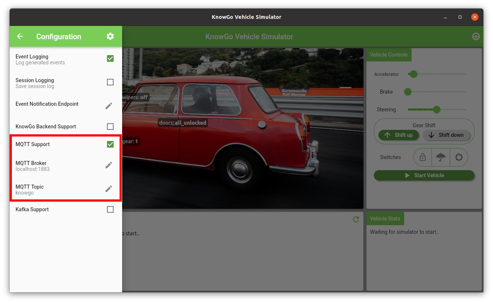
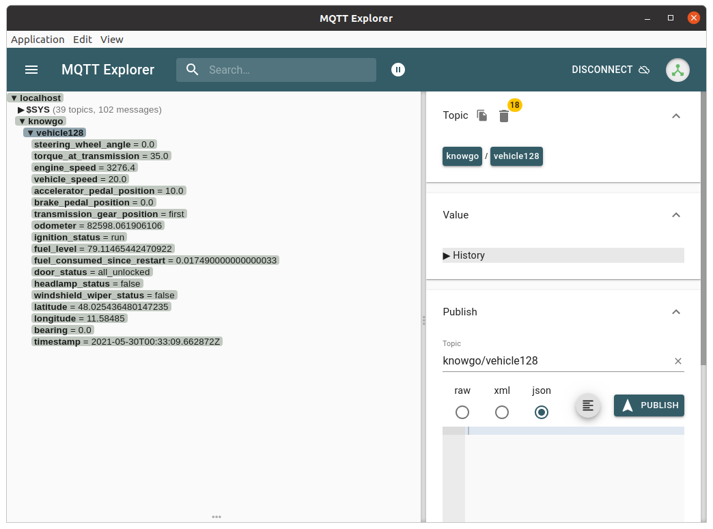
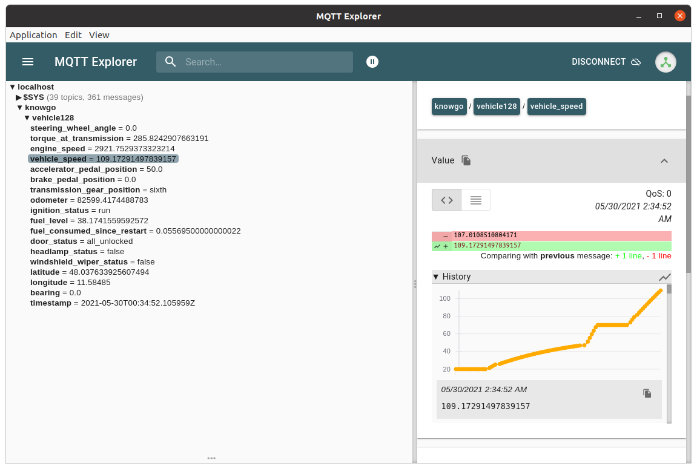

# Connecting to MQTT

Vehicle events can be streamed directly to an MQTT broker, allowing
the vehicle state to be dynamically updated, with readings of interest
able to be individually monitored and updates subscribed to.

## Setting up an MQTT Broker

!!! note
    While it is recommended to run a local broker, if you do not have a
    local broker available and are unable to set one up, there are a
    number of public brokers available for testing, such as
    [test.mosquitto.org].

[test.mosquitto.org]: http://test.mosquitto.org/

The simplest way to set up a local broker is to run the broker in a
self-contained Docker container. The open source Eclipse Mosquitto
broker comes [ready to run](https://hub.docker.com/_/eclipse-mosquitto)
for a wide range of architectures.

Running the broker is a simple matter of:

```
docker run -p 1883:1883 eclipse-mosquitto
```

which will run with the default configuration and expose the broker
port `1883` to the host network.

## Publishing to an MQTT Broker

Once you have a broker available, the settings can be entered into
the simulator. First make sure that the `MQTT Support` checkbox is
selected, then enter the broker address and the topic name:



After starting the vehicle, event telemetry should begin flowing into
the broker.

## Subscribing to an MQTT Topic

To subscribe or monitor messsages coming into the broker for a given
topic, you will need an MQTT client. If you prefer to use the command
line, the official Eclipse Mosquitto client/server can be installed
from [here](https://mosquitto.org/download/). If you prefer a graphical
interface, [MQTT Explorer] is a good option.

If using the Mosquitto client, topics can be subscribed to as:

```
mosquitto_sub -t <topic>
```

If using MQTT Explorer, topic subscriptions are managed under the
`Advanced` button under the broker settings.

### Sub-Topics & Subscriptions Per-Reading

The following individually subscribable sub-topics are created by default:

```text
<topic> / vehicle<vehicleID> / steering_wheel_angle
<topic> / vehicle<vehicleID> / torque_at_transmission
<topic> / vehicle<vehicleID> / engine_speed
<topic> / vehicle<vehicleID> / vehicle_speed
<topic> / vehicle<vehicleID> / accelerator_pedal_position
<topic> / vehicle<vehicleID> / brake_pedal_position
<topic> / vehicle<vehicleID> / transmission_gear_position
<topic> / vehicle<vehicleID> / odometer
<topic> / vehicle<vehicleID> / ignition_status
<topic> / vehicle<vehicleID> / fuel_level
<topic> / vehicle<vehicleID> / fuel_consumed_since_restart
<topic> / vehicle<vehicleID> / door_status
<topic> / vehicle<vehicleID> / headlamp_status
<topic> / vehicle<vehicleID> / windshield_wiper_status
<topic> / vehicle<vehicleID> / latitude
<topic> / vehicle<vehicleID> / longitude
<topic> / vehicle<vehicleID> / bearing
<topic> / vehicle<vehicleID> / timestamp
```

This can be seen in the default [MQTT Explorer] view when connecting to
the broker:



each sub-topic can then be examined and plotted individually:



### Topic Wildcards

For the default case of there only being a single vehicle connected to
the broker, the `+` wildcard may be used for matching the vehicle:

```text
<topic> / + / <reading>
```

This can be useful in the case where the vehicle ID has not been
pre-configured in the configuration settings and is dynamically
created by the simulator.

To obtain all readings for a given vehicle, the `#` wildcard may be
used for the subscription:

```text
<topic> / + / #
```

For the fleet case where multiple simulators are generating events for
multiple vehicles, you will need to specify the ID of the vehicle you
are interested in explicitly.


[MQTT Explorer]: http://mqtt-explorer.com/